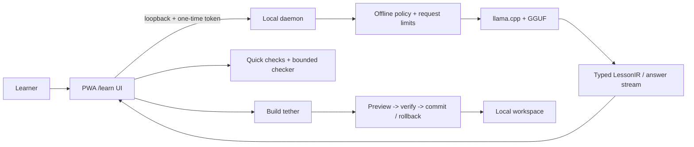

# GDMCode architecture

GDMCode treats the model as one replaceable local component. The product's
reliability comes from the boundaries around it.

## User-facing surfaces

- **Learn:** beginner lessons, examples, quick checks, and local progress.
- **Practice:** a small coding workspace with deterministic, bounded checks.
- **Build tether:** explanation beside the current snippet, with explicit
  write/execute controls rather than invisible agent actions.
- **Offline/Online:** Offline is the default and is visible in the top bar.
  Online mode is an explicit opt-in; it is not needed for local inference.

## Safety and correctness boundaries

1. Model output is parsed into typed structures before trusted UI components
   render it. Raw markup is not treated as application instructions.
2. The checker reports bounded syntax/test/policy outcomes. It does not claim
   that arbitrary code was executed or that generated code is secure.
3. File changes are transactional: snapshot, preview, verify, then commit or
   rollback. There is no silent write to a learner's repository.
4. The daemon is loopback-bound and token-authenticated. The offline policy
   fails closed when network access is disabled.
5. The model artifact is loaded locally through `llama.cpp`; no cloud request
   is required after download.

This separation lets the same harness host a smaller 2B model on lower-memory
machines while keeping the lesson, checker, and transaction semantics stable.
