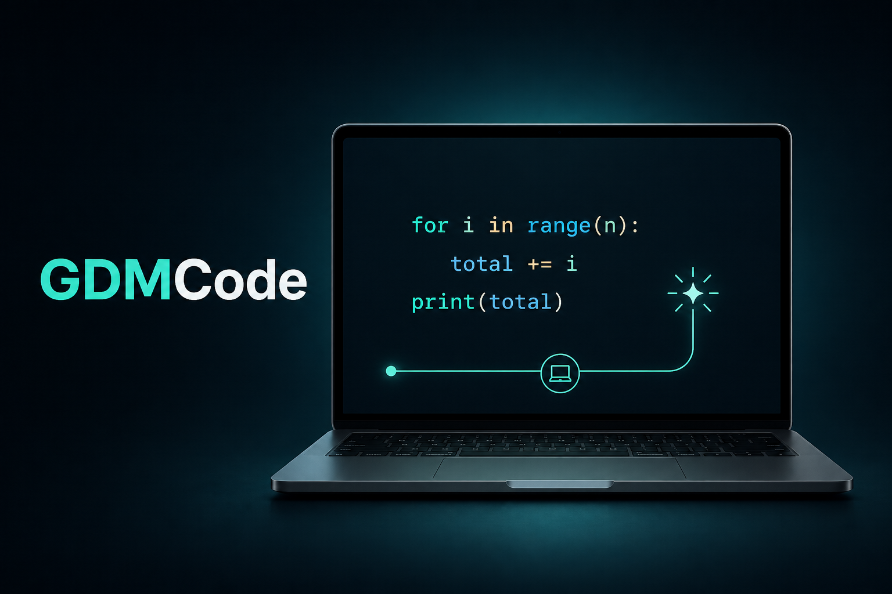
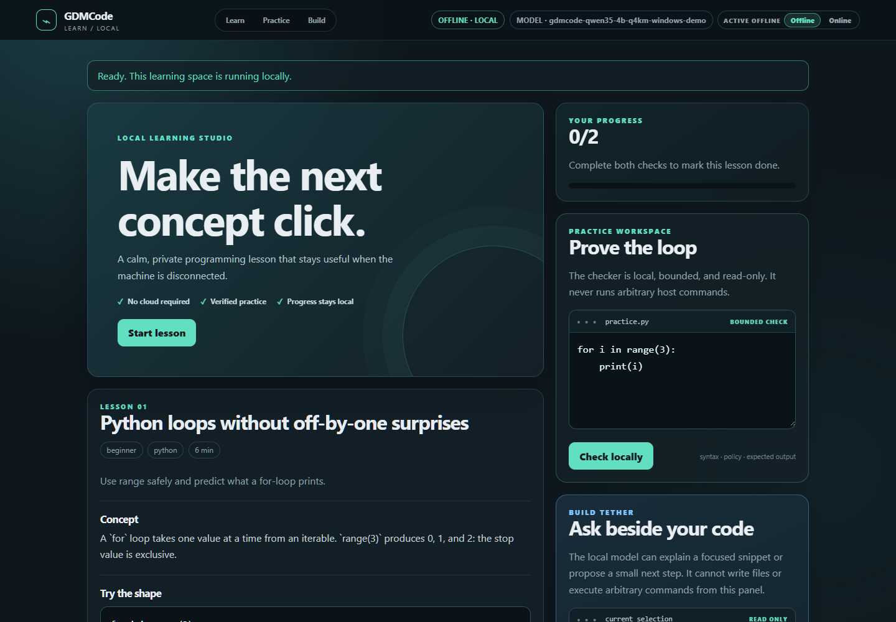
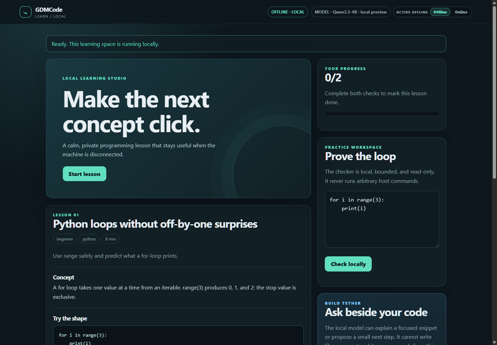
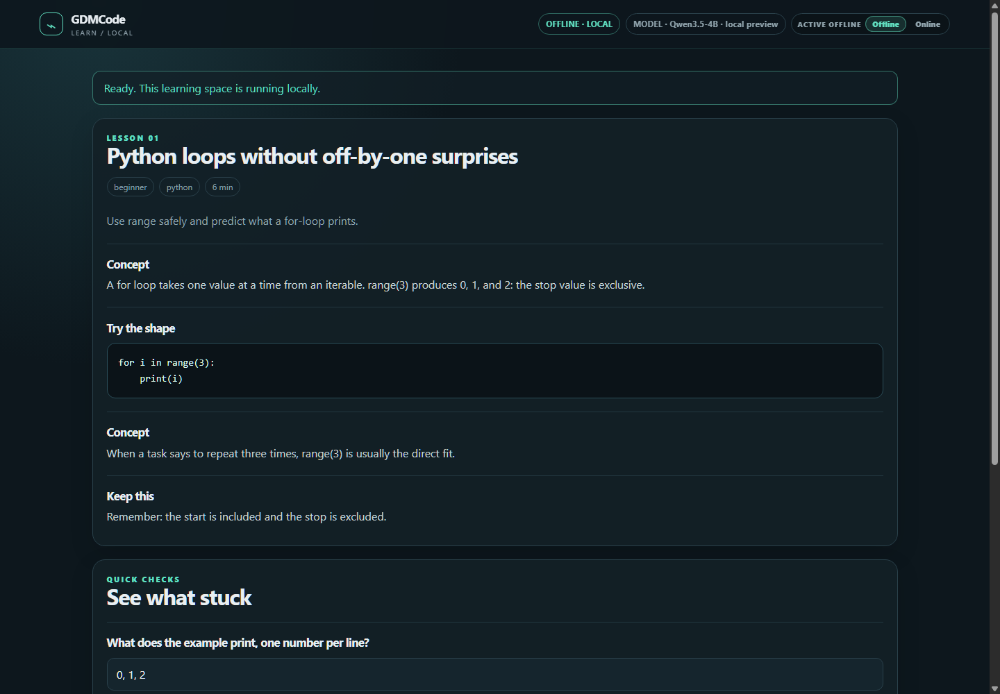
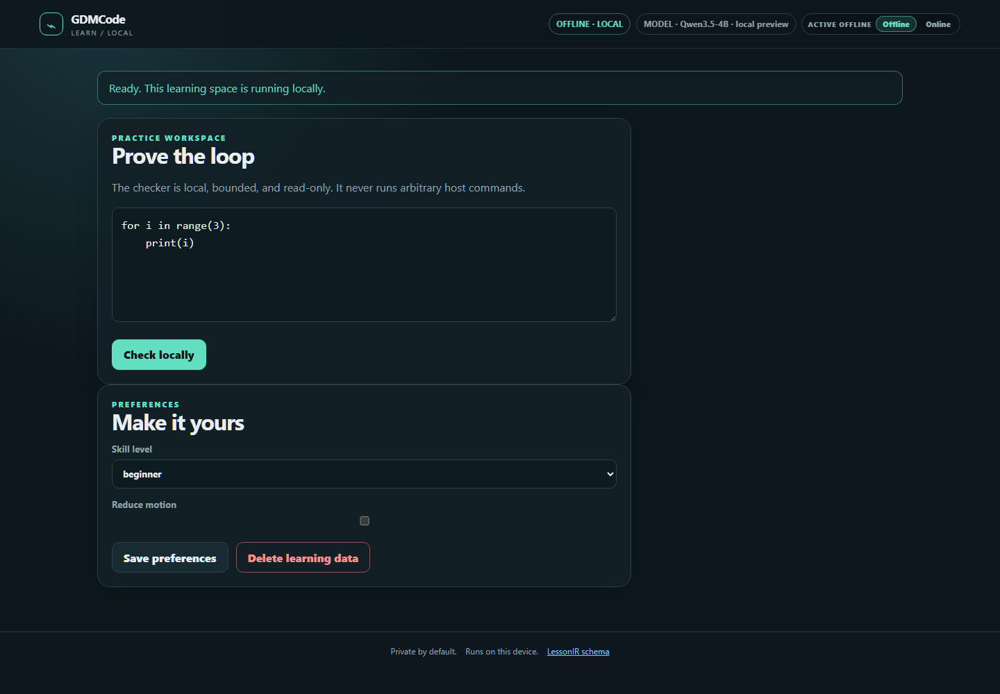
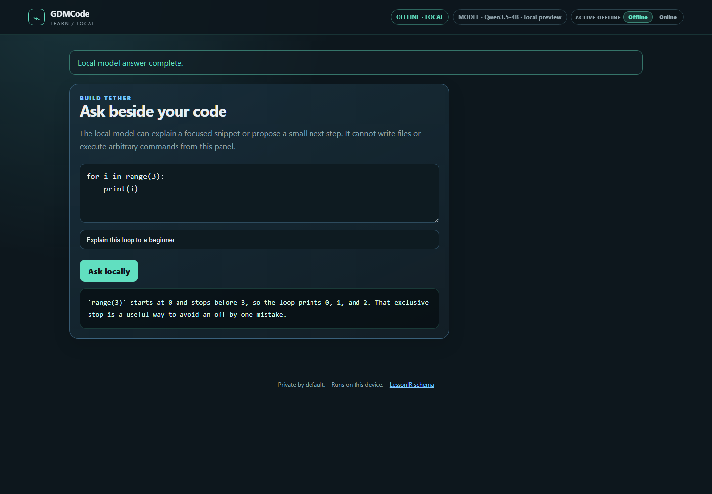

# UI preview gallery

`project-thumbnail.png` is the 3:2 Devpost cover image. It is a brand visual,
not model or benchmark evidence.

`01-hero-offline-real.png` was captured from the Windows GDMCode binary with
the frozen 4B GGUF verified, registered, loaded, and forced into Offline mode.
It is runtime evidence for the hero/status surface only.

These four images are **fixture-only UI previews** captured from the checked-in
PWA surface through a loopback preview server. They are included to make the
interface and information hierarchy reviewable without committing a model.
They do not demonstrate generated model text, latency, accuracy, or a running
daemon. The final media upload should replace or supplement them with captures
from the frozen candidate and the real local daemon.

